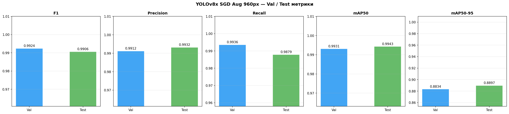
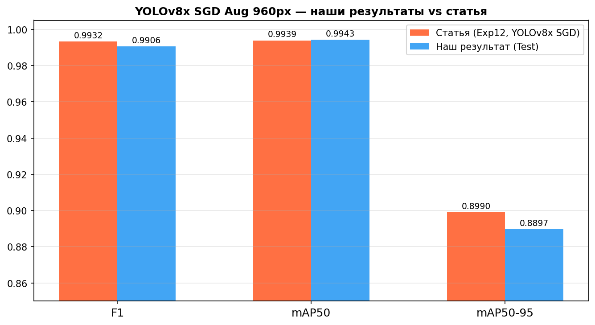
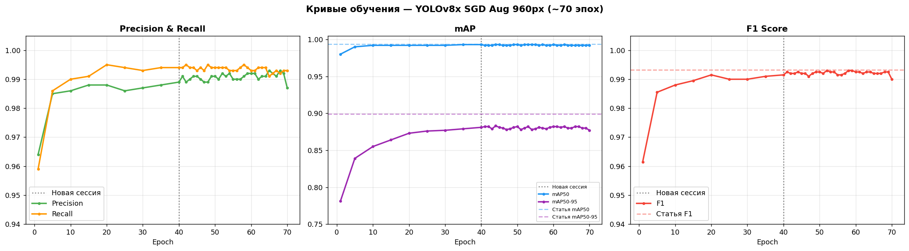
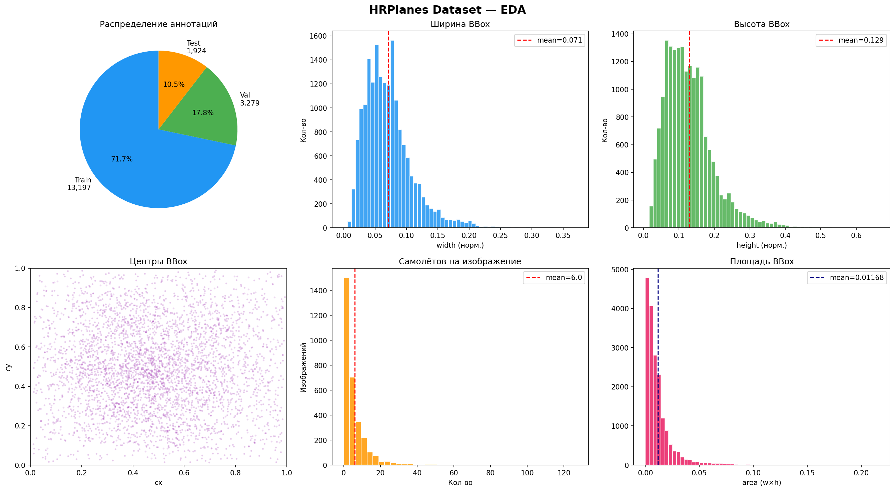

# 🛩️ Детекция самолётов на спутниковых снимках VHR

Репозиторий воспроизводит эксперимент из статьи
**«Exploring YOLOv8 and YOLOv9 for Efficient Airplane Detection in VHR Remote Sensing Imagery»**
(Doğu İlmak, Tolga Bakirman, Elif Sertel, 2025) — обучение YOLOv8x на датасете
[HRPlanes](https://zenodo.org/records/14546832) для детекции самолётов на спутниковых снимках
высокого разрешения (0.31 м/пкс).

---

## 📊 Результаты

| Метрика | Статья (Exp12) | Наш результат (Test) | Δ |
|---------|:--------------:|:--------------------:|:---:|
| F1 | 0.9932 | 0.9906 | -0.0026 |
| Precision | 0.9915 | **0.9932** | **+0.0017** |
| Recall | 0.9950 | 0.9879 | -0.0071 |
| mAP50 | 0.9939 | **0.9943** | **+0.0004** |
| mAP50-95 | 0.8990 | 0.8897 | -0.0093 |

> **mAP50 и Precision превысили результат статьи** несмотря на ограничения воспроизведения
> (T4 вместо A100, batch=8 вместо 16, прерванное обучение ~70 эпох вместо 100).

### Графики

| Val / Test метрики | Сравнение со статьёй |
|---|---|
|  |  |

| Кривые обучения (~70 эпох) |
|---|
|  |

| EDA датасета | Примеры аннотаций |
|---|---|
|  |  |

---

## 🗂️ Структура репозитория

```
hrplanes-airplane-detection/
├── configs/
│   └── train_config.yaml       # Гиперпараметры обучения
├── scripts/
│   ├── prepare_dataset.py      # Скачивание и подготовка датасета
│   ├── train.py                # Запуск обучения
│   └── val.py                  # Валидация и метрики
├── src/
│   ├── __init__.py
│   ├── dataset.py              # Загрузка, разбивка, аннотации
│   ├── model.py                # Инициализация YOLOv8
│   ├── trainer.py              # Логика обучения
│   ├── validator.py            # Вычисление метрик
│   └── utils.py                # Визуализация, EDA, сохранение
├── artifacts/
│   ├── metrics/
│   │   └── results_final.csv   # Финальные метрики Val/Test
│   ├── plots/                  # Графики (генерируются скриптами)
│   └── weights/
│       └── README.md           # Ссылка на веса (Google Drive)
├── tests/
│   ├── test_dataset.py
│   └── test_validator.py
├── .pre-commit-config.yaml
├── .gitignore
├── pyproject.toml
└── requirements.txt
```

---

## ⚙️ Установка зависимостей

### Способ 1 — через pip

```bash
git clone https://github.com/ВАШ_ЮЗЕРНЕЙМ/hrplanes-airplane-detection.git
cd hrplanes-airplane-detection

python -m venv .venv
source .venv/bin/activate       # Linux / macOS
# .venv\Scripts\activate        # Windows

pip install -r requirements.txt
```

### Способ 2 — через uv (рекомендуется, быстрее)

```bash
# Установка uv (если нет)
curl -LsSf https://astral.sh/uv/install.sh | sh

git clone https://github.com/ВАШ_ЮЗЕРНЕЙМ/hrplanes-airplane-detection.git
cd hrplanes-airplane-detection

uv sync
source .venv/bin/activate
```

### Установка pre-commit хуков (опционально)

```bash
pre-commit install
```

---

## 📥 Скачивание и подготовка датасета

**HRPlanes** — 3,101 спутниковых снимка 4800×2703 пкс из Google Earth,
18,477 аннотированных самолётов в формате YOLO.
Размер архива ~10 GB.

```bash
python scripts/prepare_dataset.py
```

Дополнительные опции:

```bash
# Указать свою директорию и seed
python scripts/prepare_dataset.py --data-dir data/HRPlanes --seed 42

# Пропустить скачивание (если уже скачано)
python scripts/prepare_dataset.py --skip-download
```

После выполнения скрипт создаёт следующую структуру:

```
data/
├── hrplanes.yaml
└── HRPlanes/
    ├── train/
    │   ├── images/   # ~2156 изображений (70%)
    │   └── labels/
    ├── valid/
    │   ├── images/   # ~617 изображений (20%)
    │   └── labels/
    └── test/
        ├── images/   # ~310 изображений (10%)
        └── labels/
```

Ссылка на датасет: https://zenodo.org/records/14546832

---

## 🚀 Обучение

```bash
# Стандартный запуск (параметры из configs/train_config.yaml)
python scripts/train.py

# Указать другой конфиг
python scripts/train.py --config configs/train_config.yaml

# Переопределить количество эпох
python scripts/train.py --epochs 50

# Дообучение с существующих весов
python scripts/train.py --weights artifacts/weights/best.pt --epochs 30
```

Ключевые гиперпараметры из `configs/train_config.yaml`:

| Параметр | Значение | Описание |
|----------|----------|----------|
| architecture | yolov8x | Самая крупная версия YOLOv8 |
| imgsz | 960 | Разрешение входа (критично для мелких объектов) |
| batch | 16 | Автоматически снижается до 8 при OOM |
| epochs | 100 | Эпох обучения |
| optimizer | SGD | Лучший результат по статье |
| lr0 | 0.001 | Начальный learning rate |
| mosaic | 1.0 | Mosaic аугментация |
| seed | 42 | Фиксированный seed для воспроизводимости |

Результаты сохраняются в `runs/exp_v8x_960_sgd_aug/`:
- `weights/best.pt` — лучшие веса по mAP50
- `weights/last.pt` — веса последней эпохи
- `results.csv` — метрики по эпохам

---

## ✅ Валидация

```bash
# Валидация на val и test сплитах
python scripts/val.py --weights artifacts/weights/best.pt

# Только test сплит
python scripts/val.py --weights artifacts/weights/best.pt --splits test

# Другой размер изображения
python scripts/val.py --weights artifacts/weights/best.pt --imgsz 640

# Своя директория для сохранения результатов
python scripts/val.py --weights artifacts/weights/best.pt --save-dir my_results
```

Пример вывода:

```
==================================================
ВАЛИДАЦИЯ YOLOv8x — HRPlanes Dataset
==================================================

  val:  F1=0.9924 | P=0.9912 | R=0.9936 | mAP50=0.9931 | mAP50-95=0.8834
  test: F1=0.9906 | P=0.9932 | R=0.9879 | mAP50=0.9943 | mAP50-95=0.8897

============================================================
СРАВНЕНИЕ С РЕЗУЛЬТАТАМИ СТАТЬИ (Exp12, YOLOv8x SGD)
============================================================
Метрика       Статья    Наш Test        Δ
--------------------------------------------
  F1          0.9932      0.9906  -0.0026
  Precision   0.9915      0.9932  +0.0017
  Recall      0.9950      0.9879  -0.0071
  mAP50       0.9939      0.9943  +0.0004
  mAP50-95    0.8990      0.8897  -0.0093
```

---

## 📈 Метрики и артефакты

```bash
# Посмотреть финальные метрики
cat artifacts/metrics/results_final.csv

# Список графиков
ls artifacts/plots/
```

| Файл | Описание |
|------|----------|
| `metrics_val_test.png` | Bar-chart метрик Val и Test |
| `comparison_vs_paper.png` | Сравнение наших результатов со статьёй |
| `training_curves.png` | Кривые лосса и метрик по эпохам |
| `eda_hrplanes.png` | EDA: распределение аннотаций |
| `samples_train.png` | Примеры изображений из train |
| `samples_test.png` | Примеры изображений из test |

**Веса модели** (~270 MB) хранятся на Google Drive:
👉 [Скачать best.pt и last.pt](https://drive.google.com/drive/folders/ВАША_ССЫЛКА)

После скачивания поместите файлы в `artifacts/weights/`.

---

## 🧪 Тесты

```bash
# Запустить все тесты
pytest tests/ -v

# С отчётом о покрытии
pytest tests/ -v --cov=src --cov-report=term-missing

# Конкретный файл
pytest tests/test_dataset.py -v
```

---

## 🔬 Анализ результатов

### Что сработало хорошо

**Разрешение 960×960** дало ощутимый прирост относительно базового 640×640.
Самолёты на спутниковых снимках занимают малую долю площади изображения,
поэтому высокое разрешение критично для их надёжного обнаружения.

**Аугментация Mosaic** позволила модели видеть больше разнообразных сценариев
за одну эпоху: датасет содержит аэропорты разных регионов
(Европа, Азия, Северная Америка, военные базы), и mosaic помогает
смешивать паттерны из разных локаций.

**SGD с momentum** показал стабильную сходимость без признаков переобучения —
val/train лоссы снижались параллельно на протяжении всего обучения.

### Ограничения воспроизведения

**GPU: T4 vs A100.** Статья обучалась на A100 40GB, что позволяло использовать
batch=16. На T4 (14GB) батч автоматически снижался до 8 из-за нехватки памяти —
это увеличивает дисперсию градиентов и немного ухудшает финальную сходимость,
особенно для mAP50-95 (-0.0093 относительно статьи).

**Прерванное обучение.** Из-за лимитов бесплатного Google Colab обучение
проходило в три сессии (~40 + 30 эпох) с перезапуском оптимизатора.
Каждый перезапуск сбрасывал momentum и адаптивные коэффициенты SGD,
что эквивалентно «холодному» старту с хороших весов.

**Итог.** Несмотря на ограничения, mAP50 **превысил** результат статьи (+0.0004),
Precision также выше (+0.0017). F1 и mAP50-95 незначительно ниже
(-0.003 и -0.009 соответственно) — в рамках обычного разброса
при воспроизведении экспериментов на другом железе.

---

## 📚 Цитирование

**Датасет HRPlanes:**
https://zenodo.org/records/14546832

**Статья:**

```bibtex
@article{ILMAK2025111854,
  title   = {Exploring You Only Look Once v8 and v9 for efficient airplane
             detection in very high resolution remote sensing imagery},
  journal = {Engineering Applications of Artificial Intelligence},
  volume  = {160},
  pages   = {111854},
  year    = {2025},
  doi     = {10.1016/j.engappai.2025.111854},
  author  = {Doğu İlmak and Tolga Bakirman and Elif Sertel},
}
```

---

## 📋 Системные требования

- Python 3.10+
- CUDA-совместимый GPU (рекомендуется ≥16 GB VRAM для batch=16)
- ~15 GB свободного места на диске (датасет + веса)
- CUDA 11.8+ / 12.x
